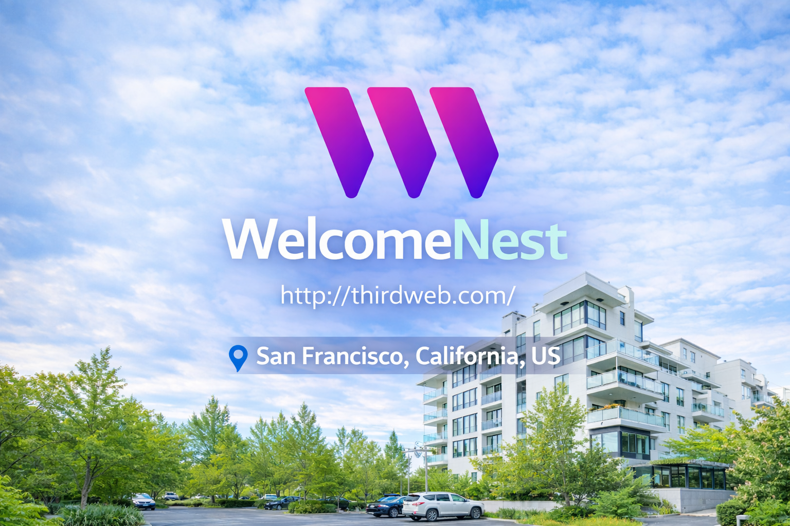
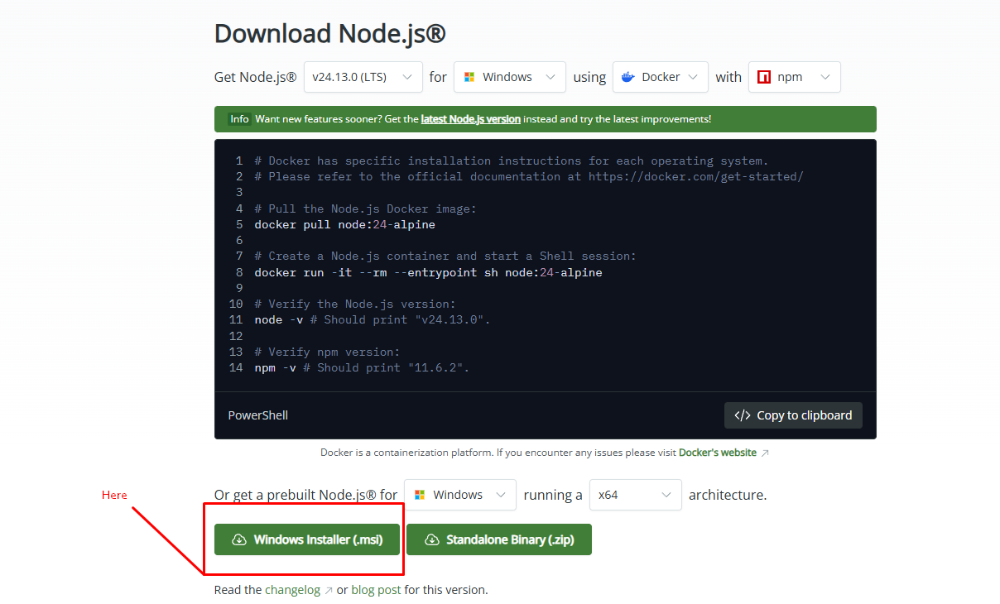
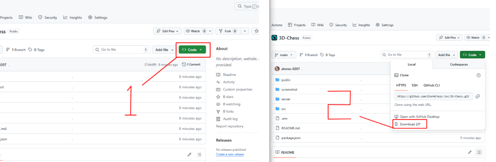

## WelcomeNest
WelcomeNest is a blockchain-based property rental platform inspired by traditional models like Airbnb, but enhanced with NFT and smart contract technology. 

Real-world properties are tokenized as NFTs containing verified details and availability. Users connect their wallets to browse listings and book stays through smart contracts that automate reservations and escrow payments. 

Funds are securely held on-chain and released after check-out, while NFT transfers and fractional ownership enable secondary sales and real estate investment opportunities.




---

## 🛠️ **Guide for setting up the AirBNB project**


### ✅ **Step 1: Download Node.js and Install it** 

👉 https://nodejs.org/en/download 

**Screenshot for reference:**  


---

### ✅ **Step 2: Download the Project**


   **Screenshot for reference:**  


---

### ✅ **Step 3: On the **Downloads**:**

   📌 Extract downloaded project( `.zip` file )

   📌 Replace extracted folder(directory) name to `airbnb`

   📌 Open Terminal 
      
   - MacOS ( type `Command(⌘) + Space` → type `terminal` → type `Enter` )
   - Windows ( type `Win + R` → type `cmd` → type `Enter` )

   📌 Navigate to the Project Directory on Terminal

   ```bash
   cd ~/Downloads/airbnb
   ```
   📌Install Project Dependencies ( This will take time 1~2 minutes )

   ```bash
   /Downloads/airbnb>npm install
   ```
   📌 Start the Project

   ```bash
   /Downloads/airbnb>npm start
   ```

---

### 👍 That’s it! The project should now be running successfully

---
